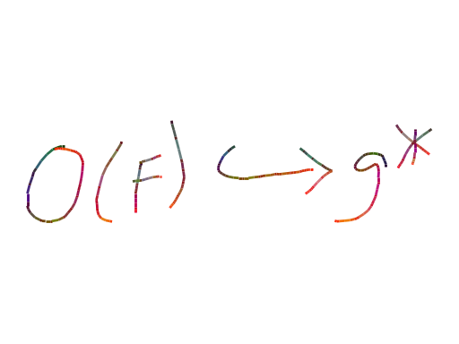

# HME_Training

Training code for handwritten mathematical expression recognition using a bidirectionally-trained transformer, and a canvas GUI to write math, perform inference, and copy resulting LaTeX to clipboard. 

# Color Channel Embedding

Just as in text-to-text translation or image-captioning tasks, an encoder-decoder architecture is used here. The encoder is a pretrained Densenet-121 CNN and the decoder is a standard implementation of the one presented in *Attention is All You Need*. The pretrained Densenet means that all three color channels are being used, and thus it is a bit of a waste to only process black-on-white images. For that reason, it becomes useful to embed time and distance information into color channels. This is performed with online InkML-format data (online as in opposed to *offline* image data) that represents the coordinates and timestamp of points sampled along pen strokes. For each line segment, its red, green, and blue channels are normalized between [0, 1], calculated by `timestamp / time of entire stroke`, `x-displacement * scaling_x / (max x - min x) `, and `y-displacement * scaling_y / (max y - min y)` respectively. The distance values were consistently less than 0.004 = 1/255, so the scaling was added to ensure their impact. Below you can see an example of a modified image.

# Bidirectionality

# References

- The model architecture is from [this paper](https://arxiv.org/abs/2105.02412) by Zhao et al. (2021)
- The idea to embed time and distance information into color channels came from [this paper](https://arxiv.org/html/2402.15307v1) by Fadeeva et al. (2024)
- Training samples are obtained from [MathWriting](https://arxiv.org/html/2404.10690v1) coming out of Google Research
- Timothy Leung's [blog](https://actamachina.com/) post was a great help in getting started with the PyTorch code

